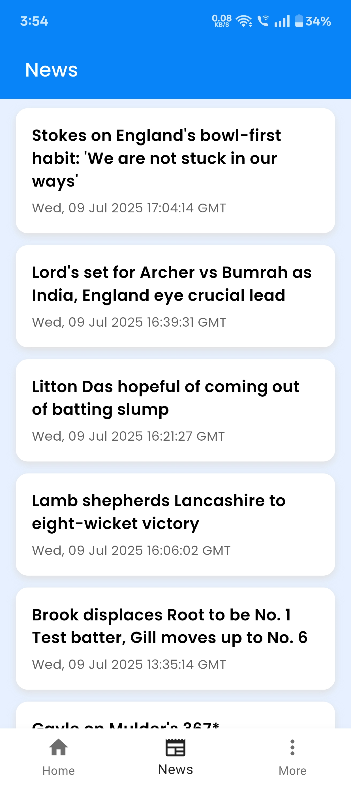
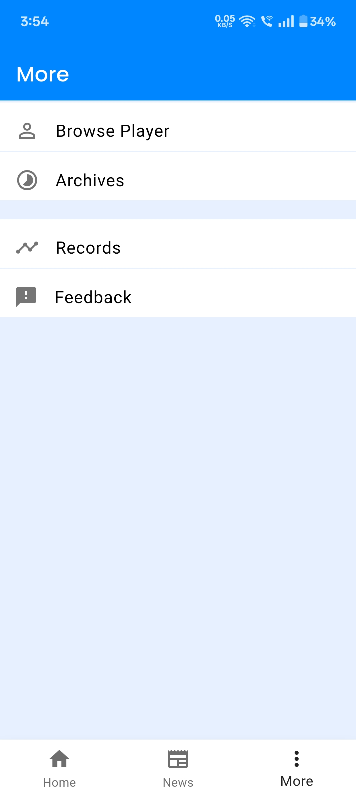
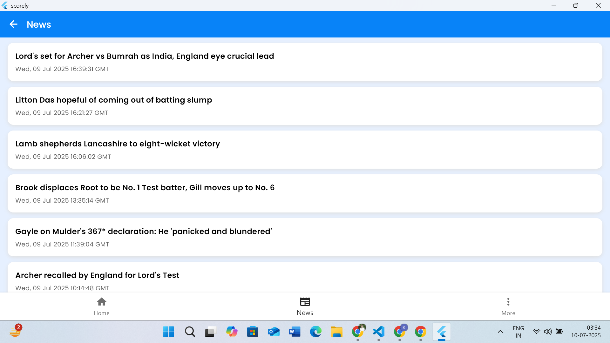

## Scorely - Live Cricket Score App

 Scorely is a Flutter-powered mobile and web app built for cricket lovers, delivering live scores, Cricket News, match info, and upcoming series schedule.

## Features

- Live match scores and status
- Stay updated with the latest cricket news in an in-app feed.
- List of upcoming series (ODIs, T20Is, Tests, Domestic Matches)
- Match details with team names, logos, scores, and status
- Pull-to-refresh and auto refresh every 10 Seconds
- Simple and clean UI

## Screenshots

- Splash Screen  
  

- Featured Tab (Mobile View)  
  

- Upcoming Feed (Mobile View)  
  

- News Feed (Mobile View)  
  

- More Sections(Mobile View)  
  

- News Feed (Windows UI)    
  

- Flutter Windows UI – Featured Tab      
  

- Flutter Windows UI – Upcoming Feed     
  

## Backend Infrastructure

### Match Data API

API Used: CricAPI

Type: RESTful API

### News Feed

Source: ESPN Cricinfo Home RSS Feed

Type: RSS (XML)
 

## Frontend Architecture

Framework: Flutter (Cross-platform SDK)

Language: Dart

Networking: `http` package for REST and XML fetching

XML Parsing: `xml` package used for handling RSS News Feed

Navigation: navigator: v1.1.1
