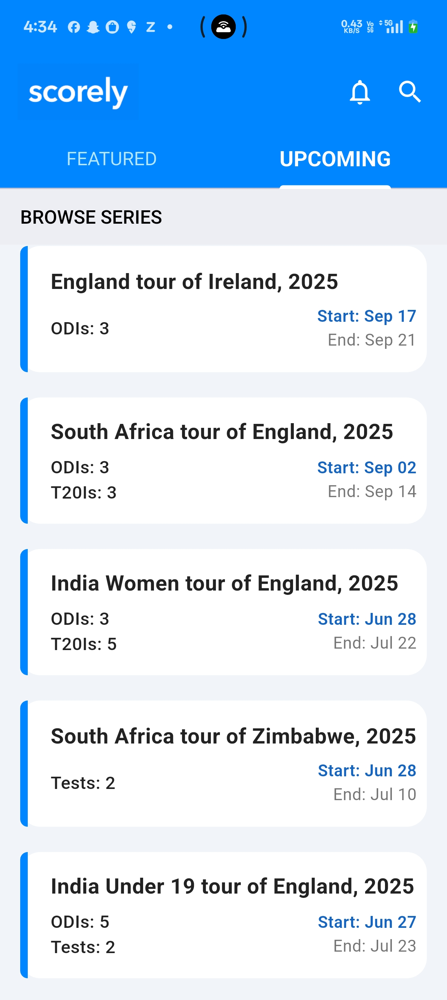

## Scorely - Live Cricket Score App

 Scorely is a Flutter-based mobile application that aims to provide cricket enthusiasts with real-time cricket match scores, detailed match info and upcoming Series List.

## Features

- Live match scores and status
- List of upcoming series (ODIs, T20Is, Tests, Domestic Matches)
- Match details with team names, logos, scores, and status
- Pull-to-refresh and auto refresh every minute
- Simple and clean UI

## Screenshots

- Splash Screen  
  

- Featured Tab  
  

- Upcoming Feed  
  

## Backend Infrastructure

API Used: CricAPI

Type: RESTful API
 

## Frontend Architecture

Framework: Flutter (Cross-platform SDK)

Custom date/time formatter

Navigation: navigator: v1.1.1