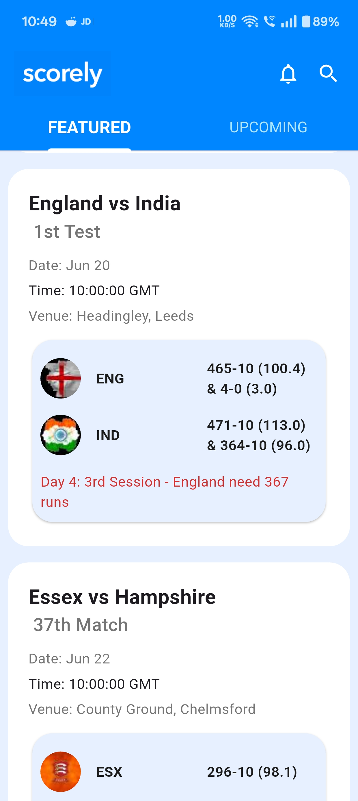
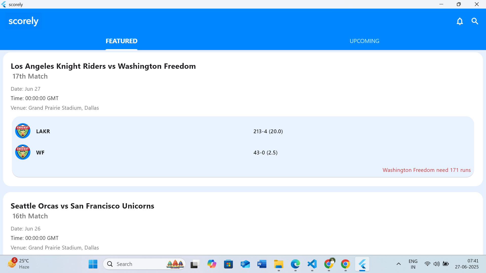
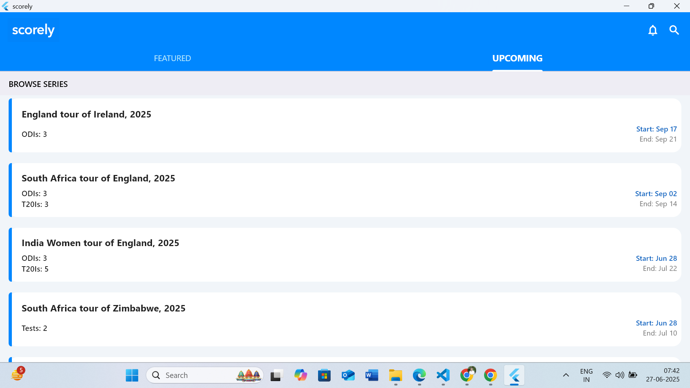

## Scorely - Live Cricket Score App

 Scorely is a Flutter-powered mobile and web app built for cricket lovers, delivering live scores, match info, and upcoming series schedules.
## Features

- Live match scores and status
- List of upcoming series (ODIs, T20Is, Tests, Domestic Matches)
- Match details with team names, logos, scores, and status
- Pull-to-refresh and auto refresh every minute
- Simple and clean UI

## Screenshots

- Splash Screen  
  

- Featured Tab (Mobile View)  
  

- Upcoming Feed (Mobile View)  
  

- Flutter Windows UI – Featured Tab  
  

- Flutter Windows UI – Upcoming Feed  
  

## Backend Infrastructure

API Used: CricAPI

Type: RESTful API
 

## Frontend Architecture

Framework: Flutter (Cross-platform SDK)

Language: Dart

Navigation: navigator: v1.1.1
